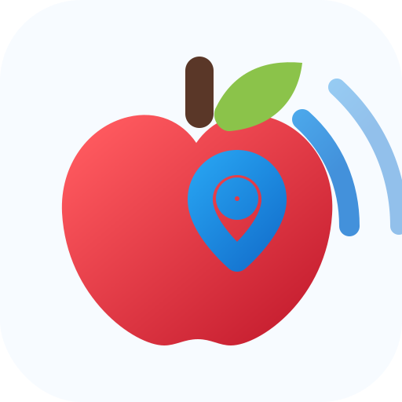

# Lost Apple App

`hass-lost-apple-app` provides the Lost Apple App for official Apple Find My devices using FindMy.py with local anisette.

The Lost Apple App owns local storage, polling, and the setup page. The separate Lost Apple Integration pairs to this app through a local bearer token and exposes device trackers plus diagnostics in Home Assistant.

## Install

1. On Home Assistant OS, add `https://github.com/snuffy2/hass-lost-apple-app` as a third-party App repository.
2. Install the Lost Apple App.
3. Set a non-empty `pairing_token` in the Lost Apple App options. The Lost Apple App reads that value from Home Assistant's app options file at `/data/options.json`.
4. Open the Lost Apple App setup page.
5. Install the Lost Apple Integration from `https://github.com/snuffy2/hass-lost-apple-integration`.
6. Configure Find My sources on the setup page via `POST /setup/sources` by importing official FindMy accessory JSON exports.
   The Lost Apple App currently does not auto-enumerate devices from the Apple session.

## Privacy

Apple credentials, session material, and polling state stay inside the Lost Apple App's local storage. The Lost Apple Integration stores only the local Lost Apple App URL and pairing token.

## Supported Devices

The current supported path is official Apple Find My devices that can be represented as configured sources and fetched through `fetch_location()`. Manual key imports, OpenHaystack accessories, and custom non-Apple accessories are not part of the current supported path.

## Status

This project is in initial development.
